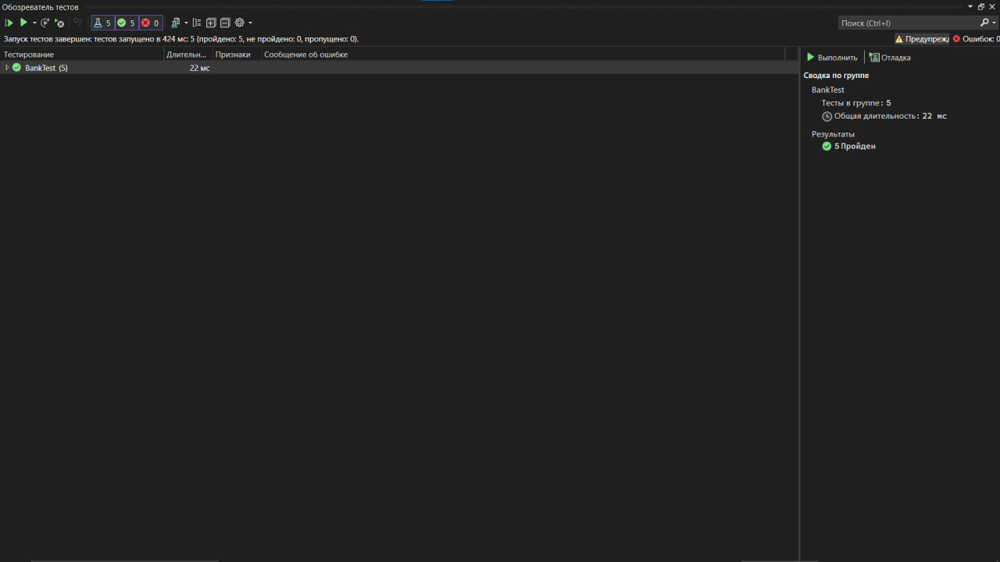

# Практическая работа №6: Создание автоматизированных unit-тестов
## Цель работы
### Провести тестирование программных модулей с использованием средств автоматизации Microsoft Visual Studio методом "белого ящика".

Описание проекта
1. Проект Bank
Создан класс BankAccount, который моделирует банковский счет.
Ключевые методы :

Debit(double amount) : Снятие средств со счета.
Credit(double amount) : Пополнение счета.
2. Тестовый проект BankTests
Создан для автоматизации тестирования методов Debit и Credit.

Результаты тестирования
1. Тестирование метода Debit
Сценарии:
Сценарий 1 : Снятие допустимой суммы.
Ожидаемый результат : Баланс уменьшается на указанную сумму.
Результат : Успешно.
Сценарий 2 : Снятие суммы меньше нуля.
Ожидаемый результат : Исключение ArgumentOutOfRangeException с сообщением "Debit amount is less than zero".
Результат : Успешно.
Сценарий 3 : Снятие суммы, превышающей баланс.
Ожидаемый результат : Исключение ArgumentOutOfRangeException с сообщением "Debit amount exceeds balance".
Результат : Успешно.
Исправление ошибки:
Изначально в методе Debit была допущена ошибка: вместо вычитания суммы (m_balance -= amount) использовалось сложение (m_balance += amount).
Исправление :
// Было:  
m_balance += amount;  
// Стало:  
m_balance -= amount;
2. Тестирование метода Credit
Сценарии:
Сценарий 1 : Пополнение счета допустимой суммой.
Ожидаемый результат : Баланс увеличивается на указанную сумму.
Результат : Успешно.
Сценарий 2 : Пополнение счета отрицательной суммой.
Ожидаемый результат : Исключение ArgumentOutOfRangeException.
Результат : Успешно.

# Скриншоты

### 1. Обозреватель тестов

